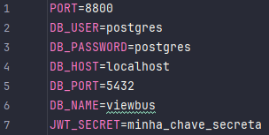

# ViewBus - Back-End

## Como Inicializar

### 1. Clone o repositório
Clone o repositório para sua máquina via git ou baixando o arquivo .zip, 
disponíveis no botão **code**, na página principal;  

### 2. Abra um novo banco de dados
Abra um novo banco de dados PostgreSQL com usuário, senha, host, port e nome à sua preferência.  

### 3. Crie um arquivo `.env` na pasta principal do projeto (viewbus);
A pasta principal é aquela que contém o arquivo `package.json` dentro dela.

### 4. Coloque as variáveis de ambiente abaixo, correspondentes ao banco de dados que você criou e às suas preferências:  
   - PORT: PORT de execução do projeto;
   - DB_USER: Nome do usuário do banco de dados que você criou;
   - DB_PASSWORD: Senha do banco de dados que você criou;
   - DB_HOST: Host do banco de dados que você criou;
   - DB_PORT: Porta do banco de dados que você criou;
   - DB_NAME: Nome do banco de dados que você criou;
   - JWT_SECRET: chave secreta para criptografia. Coloque qualquer texto de sua preferência. 
   Se utilizar espaços, será necessário botar em volta de aspas ou simples, ou duplas.
### Exemplo de arquivo `.env`:  

### 5. Rode o Projeto
Abra o terminal na pasta principal (pasta que contém o arquivo `package.json`), e execute o seguinte comando:
`npm run start`.

### 6. Feito! Agora é só usar!
Consuma a API através de seus endpoints, recomenda-se utilizar um aplicativo especializado, 
como o **[Postman](http://postman.com/)** ou **[Insomnia](http://insomnia.rest/)**.

## Endpoints

### Auth
- `POST /register` `[Public]`: Cadastra um novo usuário (Admin);
- `POST /login` `[Public]`: Recebe o token de login do usuário (Admin).

### Admin
- `GET /admin` `[Auth]`: Retorna o usuário logado;
- `PUT /admin` `[Auth]`: Altera os dados do usuário;
- `DELETE /admin` `[Auth]`: Deleta a conta logada.

### Rota
- `GET /rota` `[Public]`: Busca todas as rotas;
- `GET /rota/:id` `[Public]`: Busca a rota com `id` fornecido;
- `GET /rota` `[Auth]`: Busca todas as rotas do usuário `(getByAdmin)`;
- `POST /rota` `[Auth]`: Adiciona nova rota, atribuída ao usuário logado;
- `PUT /rota/:id` `[Auth]`: Altera a rota com `id` fornecido;
- `DELETE /rota/:id` `[Auth]`: Deleta a rota com `id` fornecido.

### Partida
- `GET /rota/:id/partidas` `[Public]`: Busca todas as partidas da rota com `id` fornecido;
- `GET /partida/:id` `[Public]`: Busca a partida com `id` fornecido;
- `POST /partida` `[Auth]`: Adiciona nova partida, com rota a ser definida no body;
- `PUT /partida/:id` `[Auth]`: Altera a partida com `id` fornecido;
- `DELETE /rota/:id` `[Auth]`: Deleta a rota com `id` fornecido.

### Feedback*
- `GET /rota/:id:/feedbacks` `[Public]`: Busca todos os feedbacks da rota com `id` fornecido;
- `GET /feedback/:id` `[Public]`: Busca o feedback com `id` fornecido;
- `POST /feedback` `[Public]`: Adiciona novo feedback, com rota a ser definida no body.  

**Perceba: Os **endpoints** relacionados à `Feedback` são públicos e possívelmente anônimos, ou seja, não é possível
identificar os usuários. Portanto, é impossível fazer endpoints de `PUT` e `DELETE` sem haver interferência 
dos não-autores. Esta função fica reservada para uma futura re-estruturação, cujos donos da aplicação possam
ter essas permissões exclusivas.*  

`[Public]`: O Endpoint é Público e não requer nenhum token para ser acessado.  
`[Auth]`: O Endpoint é Privado e precisa de autenticação padrão para ser acessado, 
ou seja, requer uma conta de Admin.  
